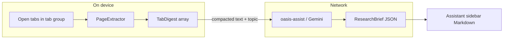

# Research Brief — MVP specification

**Status:** Draft — not shipped  
**Version baseline:** v1.0.0.12 (`8ecad89`)  
**Audience:** Product, marketing copy reviewers, assistant engineers  
**Legal review:** Required before public marketing claims (see §5)

> **Legal review:** Have legal sign off before using privacy or sovereignty language in ads, App Store listings, or public web pages.

---

## 1. Summary and user story

### Anchor scenario

A founder or writer is drafting a long-form guide (e.g. “AI Privacy Tools”). They have **10 browser tabs** open with different articles, reports, and blog posts. They want a **structured outline** and **key quotes with sources** for their draft—without copying text tab by tab or pasting URLs into a separate AI tool.

### Job to be done

Turn an **open research session** (a set of related tabs) into a **writer-ready brief**: outline, synthesized themes, and quotable excerpts—scoped to a topic the user defines.

### Persona

- Founders and writers doing **research-to-draft** workflows  
- Privacy-conscious users who care about **where data goes**, not just tab organization  
- Power users already comfortable with **tab groups** as a research workspace

### Product name (working)

**Research Brief** — invoked as “Build a research brief from [tab group] on [topic].”

---

## 2. MVP goals and non-goals

### In scope (MVP)

| Capability | Detail |
|------------|--------|
| Scope | **Tab group** (primary); **named tabs** (`scope=tabs` via title/URL keywords or indices); fallback **current window** with `max_tabs` cap |
| Tab set | **Open tabs only** in the resolved scope (default max **10**); explicit tab lists capped with omission note when over limit |
| Input | **Topic** explicit when substantive; otherwise **inferred from page content** after extraction (common for short tab group names). Optional **outline_hint** |
| Extraction | **Local** via PageExtractor (reader mode, then full text)—same strategy as `summarize_page` |
| Synthesis | **Remote** Oasis assist (Gemini via proxy)—structured JSON output |
| Output | `ResearchBrief` JSON rendered as **Markdown** in the assistant sidebar |
| Orchestration | **Single command/workflow** (`build_research_brief`), not multi-step agent chains |
| UX trigger | **Explicit user action** (natural language or future sidebar control) |
| Progress | Visible states: resolving → extracting (i/N) → synthesizing → done / partial |
| Partial success | Deliver brief when some tabs fail; mark per-source `status` |
| Disclosure | First-run **data-flow** copy: local read vs network synthesis |
| Quota | Pre-flight **token estimate**; block or confirm above threshold |
| Copy | **Copy** on AI messages (rich paste: HTML + Markdown); research briefs add per-`##` section copy; toolbar right-aligned |
| Tab exclusions | `exclude_indices` (1-based in group) and `exclude_queries` (title/URL match, min 3 chars) |

### Out of scope (MVP)

| Item | Reason |
|------|--------|
| Silent / background analysis | Trust, attention, and quota unpredictability |
| On-device LLM inference | Not available for quality outline + quotes today |
| Closed tabs / bookmark-only sets | No headless URL load in assistant sidebar MVP ([`PageExtractorParent.getHeadlessExtractor`](../../toolkit/components/pageextractor/PageExtractorParent.sys.mjs) exists for AI Window, not wired here) |
| Auto-export to Notion, Google Docs, etc. | Integration surface too large for MVP |
| Copyright / licensing guidance | Product provides research notes, not publication advice |
| “Nothing leaves your machine” marketing | Inaccurate while synthesis uses network AI |

---

## 3. UX specification

### Entry points

1. **Natural language** in Oasis Assistant sidebar, e.g.  
   - “Build a research brief from my **AI Privacy** tab group on **AI privacy tools for founders**.”  
   - “Create a research brief based on tab group **sports**.” (topic inferred from page content when omitted)  
   - “Research brief on **college football recruiting** from tab group sports.” (explicit topic)  
   - “Research brief from tabs **ESPN**, **Bleacher Report**.” (`scope=tabs`)  
   - “Research brief from tab titled **NFL draft grades**.”  
   - “Research brief from tabs **2, 3, and 5**.” (window positions)  
   - Supported scope words: `from`, `in`, `using`, `based on`, `for my` (plus `for tab group …`). Leading verbs: `create`, `make`, `build`, `write`, `generate`, `draft`, `prepare` (optional `document for`).  
   - “Research brief: topic = GDPR vs US state laws, group = Privacy Research.”
2. **Tab group context menu:** “Build research brief…” (opens assistant with group pre-filled). Sidebar chip remains future.

Routing must map these intents to `build_research_brief` (see §6.4), not to repeated `summarize_page` calls. Natural-language variants (report, consolidate, multi-tab summarize, etc.) are cataloged in [`research-brief-utterance-catalog.md`](./research-brief-utterance-catalog.md).

### Clarification

When the tab group name is ambiguous or missing:

- **Fuzzy name tie** (multiple groups match): clarification modal with one option per candidate group (`brief_group:<name>`), resume via stashed `build_research_brief` args.  
- **Obvious active-group phrasing** (`this group`, `my tab group`, `current tab group`) skips meta-prompting clarification ([`isObviousResearchBriefRequest`](../../browser/base/content/assistant/build/src/assistant/clarificationClassifier.ts)).  
- Otherwise reuse **meta-prompting clarification** with options like:  
  - “Tab group: AI Privacy (8 tabs)”  
  - “Tab group: Privacy Tools (3 tabs)”  
  - “All tabs in this window (12 tabs)—will use first 10”

### Progress states

| State | User-visible message (example) |
|-------|--------------------------------|
| `resolving` | Finding tabs in “AI Privacy”… |
| `extracting` | Reading page 3 of 8… |
| `synthesizing` | Building your research brief… |
| `done` | Brief ready (N sources) |
| `partial` | Brief ready (6 of 8 sources; 2 could not be read) |

User can **cancel** during `extracting` or `synthesizing` (P2; document intent in P1).

### Partial success

- Brief is still delivered.  
- Failed/skipped sources appear in `sources[]` with `status` and `failureReason`.  
- `executiveSummary` or `gapsAndContradictions` may note missing coverage.

### Error and empty cases

| Condition | Behavior |
|-----------|----------|
| No tab group name and window empty | Ask user to name a group or open tabs |
| Named group not found | Suggest `list_tab_groups` outcome in error message |
| Group has 0 tabs | Clear error; suggest adding tabs |
| All tabs are `about:` / `chrome://` / `moz-extension://` | Error: no readable web pages in scope |
| Paywall / empty extraction | Source `status: failed`; continue with others |
| Over daily quota | Quota message via existing subscription UX |

### Example rendered output (Markdown)

```markdown
# Research brief: AI privacy tools for founders

**Generated:** 2026-06-01 · **Sources:** 8 (6 ok, 2 failed)

## Executive summary

…

## Suggested outline

### 1. Why founders should care
- …

## Themes

### Consent and data minimization
…

## Sources

### [Article title](https://example.com/article)
> "Verbatim quote…" — context if needed

**Key claims:** …
```

---

## 4. Output schema (normative)

Implementation contract between `researchBrief` service, `assistRemote`, and UI rendering.

### TypeScript types

```typescript
type ResearchBriefQuote = {
  text: string;
  context?: string;
};

type ResearchBriefSource = {
  title: string;
  url: string;
  status: "ok" | "skipped" | "failed";
  failureReason?: string;
  keyClaims: string[];
  quotes: ResearchBriefQuote[];
};

type ResearchBriefOutlineSection = {
  heading: string;
  bullets: string[];
};

type ResearchBriefTheme = {
  label: string;
  synthesis: string;
  sourceUrls: string[];
};

type ResearchBrief = {
  topic: string;
  generatedAt: string; // ISO 8601
  scopeLabel: string; // e.g. "Tab group: AI Privacy"
  executiveSummary: string;
  outline: ResearchBriefOutlineSection[];
  themes: ResearchBriefTheme[];
  sources: ResearchBriefSource[];
  gapsAndContradictions: string[];
};
```

### LLM JSON schema (synthesis response)

The remote call must use structured output (same pattern as [`CHAT_GENERATION_CONFIG`](../../browser/base/content/assistant/build/src/assistant/graph.ts)) with `responseMimeType: "application/json"` and a schema matching `ResearchBrief` above.

### Constraints

| Field | Limit |
|-------|-------|
| `quotes[].text` | Max **500** characters per quote (truncate with ellipsis in render) |
| `quotes` per source | Max **5** |
| `outline` sections | Max **15** |
| `themes` | Max **10** |
| `keyClaims` per source | Max **8** |

### Rendering rules (`researchBriefToMarkdown`)

1. H1 = topic; metadata line for date and source counts.  
2. `executiveSummary` → H2.  
3. `outline` → H2 “Suggested outline”; each section H3 + bullets.  
4. `themes` → H2 “Themes”; each theme H3 + synthesis paragraph; optional “Sources:” list of URLs.  
5. `sources` → H2 “Sources”; each source H3 linked title; blockquotes for quotes; bullet list for `keyClaims`.  
6. `gapsAndContradictions` → H2; bullet list.  
7. Omit empty sections; show failed sources with italic failure reason.

### Wire format marker (optional)

For graph integration, the command may return:

```
__RESEARCH_BRIEF__
{ ...ResearchBrief JSON... }
```

followed by rendered Markdown for display—parallel to [`PAGE_CONTEXT_REQUEST_MARKER`](../../browser/base/content/assistant/build/src/utils/pageContextRequest.ts).

---

## 5. Privacy and messaging

### Accurate claims (MVP)

| OK to say | Do not say |
|-----------|------------|
| Page text is **read on your device** before synthesis | “Nothing leaves your machine” |
| Your **browsing history profile** is not sold to advertisers | “Fully local AI” |
| **Synthesis** uses Oasis AI over the network | “Zero data” or “zero tracking” |
| You control **anonymous vs account-linked** assistant logging (default anonymous) | That anonymous mode means **no** egress |

User-facing baseline: [oasis-your-data-and-training.md](oasis-your-data-and-training.md). Technical detail: [privacy-data-and-telemetry.md](privacy-data-and-telemetry.md).

### Data flow



### First-run disclosure (P2; copy draft for legal)

> Oasis reads the open pages in your selected tab group **on this device**, then sends compacted text and your topic to Oasis AI to build your brief. This uses the same assistant privacy settings as other Oasis AI features. [Learn more](oasis-your-data-and-training.md)

### Excluded URLs

Skip (mirror `summarize_page`):

- `about:`  
- `chrome://`  
- `moz-extension://`

Mark as `status: skipped`, `failureReason: "Internal browser page"`.

### Telemetry

Research brief usage is **assistant usage**:

- Prompt, response, tool name, tab context may be logged per [privacy-data-and-telemetry.md](privacy-data-and-telemetry.md).  
- **Open question:** redact or truncate `quotes[].text` in `interaction_data` payloads (§11).

---

## 6. Technical architecture

### 6.1 Shared page extraction helper

**New file:** [`browser/base/content/assistant/build/src/services/pageContentExtract.ts`](../../browser/base/content/assistant/build/src/services/pageContentExtract.ts)

Refactor extraction from [`SummarizePageCommand`](../../browser/base/content/assistant/build/src/commands.ts) (reader mode → full text, whitespace cleanup, 12k char cap).

```typescript
export type PageExtractResult = {
  title: string;
  url: string;
  content: string;
  status: "ok" | "failed" | "skipped";
  failureReason?: string;
};

export async function extractPageContentFromTab(
  tab: BrowserTab
): Promise<PageExtractResult>;
```

`summarize_page` and research brief **must** call this helper to avoid behavior drift.

**Constants (shared):**

| Constant | Value | Source |
|----------|-------|--------|
| `MAX_CONTENT_CHARS_PER_TAB` | 12000 | Existing `summarize_page` |
| `MIN_CONTENT_CHARS` | 50 | Existing `summarize_page` |

### 6.2 Research brief service

**New file:** [`browser/base/content/assistant/build/src/services/researchBrief.ts`](../../browser/base/content/assistant/build/src/services/researchBrief.ts)

| Responsibility | Detail |
|----------------|--------|
| Resolve scope | `tab-group` + `name` via `findGroupByName` / `getTabGroups`; `window` = visible tabs in `gBrowser` |
| Exclusions | [`researchBriefScope.ts`](../../browser/base/content/assistant/build/src/services/researchBriefScope.ts) — filter by `exclude_indices` / `exclude_queries` before cap |
| Cap tabs | Default `max_tabs = 10`; take first N in stable order after exclusions |
| Extract | `extractPageContentFromTab` with **concurrency limit 3** |
| Build digests | `{ title, url, content }[]` → `TabDigest[]` |
| Synthesize | `assistRemote` + dedicated system prompt + JSON schema |
| Render | `researchBriefToMarkdown(brief: ResearchBrief): string` |

**Internal type:**

```typescript
type TabDigest = {
  title: string;
  url: string;
  content: string;
  status: PageExtractResult["status"];
  failureReason?: string;
};
```

### 6.3 New command

**Registry:** [`commandsRegistry.ts`](../../browser/base/content/assistant/build/src/assistant/commandsRegistry.ts)

| Property | Value |
|----------|-------|
| `commandName` | `build_research_brief` |
| Args | `{ scope?, name?, topic, outline_hint?, max_tabs?, exclude_indices?, exclude_queries? }` |
| Description | Build a structured research brief (outline, themes, quotes) from open tabs in a tab group or window |

**Tool label:** [`toolLabels.ts`](../../browser/base/content/assistant/ui-preact/src/toolLabels.ts) → `Building research brief`

**Why a dedicated command:** [`MAX_NESTED_COMMANDS = 3`](../../browser/base/content/assistant/build/src/assistant/constants.ts) prevents reliable orchestration of 10× `summarize_page` in one agent turn.

### 6.4 Routing

| File | Change |
|------|--------|
| New `researchBriefRouting.ts` + tests | Phrases: “research brief”, “build a brief from”, “outline from tab group”, etc. |
| [`routerPrompt.ts`](../../browser/base/content/assistant/build/src/prompts/routerPrompt.ts) | Bullet: use `build_research_brief` for multi-tab research synthesis |
| [`pageIntentRouting.test.ts`](../../browser/base/content/assistant/build/tests/pageIntentRouting.test.ts) or new test file | Regression coverage |

Do **not** route 10-tab requests to repeated `summarize_page`.

### 6.5 Graph integration

- Command returns one tool result; graph proceeds to chat presentation (existing tool → chat path).  
- If `__RESEARCH_BRIEF__` marker present, optional hidden instruction: “Present the research brief markdown; do not re-summarize.”  
- No increase to `ASSISTANT_RECURSION_LIMIT` required for MVP.

### 6.6 Limits and quota

| Limit | Default | Notes |
|-------|---------|-------|
| `max_tabs` | 10 | Configurable arg; hard cap 15 |
| `max_total_chars` (synthesis input) | ~80000 | Sum of digest contents after per-tab cap |
| Concurrency | 3 | Parallel PageExtractor calls |
| Daily tokens | Existing subscription | Pre-flight estimate ≈ `chars/4` + synthesis overhead |

**Quota UX:**

1. After scope resolve, estimate tokens from digest size.  
2. If estimate > `daily_remaining` while `quota_mode` is `default`, show a **clarification modal** with two resume paths (not a dead-end error):  
   - **Proceed with truncated content** → `quota_mode: truncate`, `scope_confirmed: true`  
   - **Use first N tabs** → `quota_mode: fewer_tabs`, `max_tabs: N` (N from binary search on digests), `scope_confirmed: true`  
3. Resume args are stashed in interaction state (`researchBriefResume`) so the graph does not depend on NL paraphrase.  
4. Log usage via existing [`subscriptionService`](../../browser/base/content/assistant/build/src/services/subscription.ts).

**Persist / restore (pre-test):**

- On each successful brief, the latest brief (markdown, JSON, digests, `briefId`) is auto-saved per user in IndexedDB ([`researchBriefPinStore.ts`](../../browser/base/content/assistant/ui-preact/src/researchBriefPinStore.ts)).  
- After sidebar reload with an empty chat, a dismissible **Restore last research brief** banner inserts the stored brief without re-fetch; digest cache is hydrated so **Regenerate section** works.  
- **Pin brief** toggles whether the row is marked pinned; auto-save always keeps the latest brief.  
- **Cancel** during synthesis aborts in-flight `fetch` on the client (best-effort; the server may still complete).

---

## 7. Map-reduce strategy

### Phase A — Local extract (always)

For each tab in scope (up to `max_tabs`):

1. `extractPageContentFromTab`  
2. Append to `TabDigest[]` (include failed/skipped with empty content)

### Phase B — Remote synthesize (MVP default)

If `sum(digest.content.length) <= max_total_chars`:

- **Single** `assistRemote` call with system prompt + all digests + topic + outline_hint  
- Model returns `ResearchBrief` JSON  
- Render to Markdown

### Phase B-prime — Over budget (MVP+1 / P3)

If total chars exceed `max_total_chars`:

1. **Per-tab micro-summary** (bounded N calls, e.g. max 10) producing `{ url, summary, candidateQuotes }`  
2. **Final merge** call with micro-summaries only  
3. Document threshold tuning after P1 dogfood

**MVP fallback when over budget without B-prime:** truncate digests proportionally and warn in `gapsAndContradictions` that content was truncated.

---

## 8. Testing strategy

### Unit tests

| Target | Cases |
|--------|-------|
| `researchBriefToMarkdown` | Full brief, partial failures, empty outline |
| Schema validation | Valid/invalid LLM JSON |
| Scope resolution | Group by name, window fallback, missing group |
| `pageContentExtract` | Mock PageExtractor; about: URLs skipped |

### Integration tests

| Target | Cases |
|--------|-------|
| `researchBriefRouting` | Trigger phrases → `build_research_brief` |
| Command args parsing | topic required, max_tabs clamped |

### Manual test plan

1. Create tab group with 3 public articles on one topic; run brief; verify outline + quotes + URLs.  
2. Mix 1 paywalled / empty tab; verify `partial` status.  
3. Group name collision; verify clarification modal.  
4. Request with 12 tabs; verify cap at 10.  
5. Near daily quota limit; verify block or confirm.  
6. Privacy settings unchecked; verify assist still works; disclosure copy accurate.

---

## 9. Phased delivery

| Phase | Scope | Shippable increment |
|-------|--------|---------------------|
| **P0** | This spec + index links | Alignment |
| **P1** | `pageContentExtract` refactor + `researchBrief` service + `build_research_brief` + routing | Power users via chat |
| **P2** | Progress UI, cancel, scope preview, URL dedupe, disclosure banner, tab group context menu; copy on AI messages shipped | Shipped in assistant |
| **P3** | Map-reduce over budget, session pin brief in IndexedDB | 10 long articles reliably |
| **Future** | Headless extract for bookmarks; on-device map step | Sovereignty tier |

### P1 file checklist

- `services/pageContentExtract.ts` (new)  
- `services/researchBrief.ts` (new)  
- `commands.ts` — `BuildResearchBriefCommand`  
- `commandsRegistry.ts` — register command (53 tools)  
- `prompts/researchBriefPrompt.ts` (new)  
- `utils/researchBriefRouting.ts` + tests (new)  
- `routerPrompt.ts` — routing bullet  
- `toolLabels.ts` — label  
- `commands.ts` — `SummarizePageCommand` uses shared extract  

---

## 10. Success metrics

| Metric | Target (initial) | Instrument |
|--------|------------------|------------|
| Task completion | > 80% of started briefs reach `done` | Tool result telemetry |
| Partial success rate | Track % with ≥1 failed source | `sources[].status` in logs (aggregated) |
| Time to brief (p50) | < 60s for 5 medium articles | Client timing event |
| Repeat usage | Users run ≥2 briefs in 7 days | Cohort on tool name |
| Qualitative | User pastes outline without re-copying tabs | User interviews / PH comments |

---

## 11. Open questions (iteration log)

| # | Question | MVP default |
|---|----------|-------------|
| 1 | Tab-group only vs window scope? | Both; **tab-group preferred** in copy |
| 2 | Include active tab when not grouped? | No; prompt user to create/select group |
| 3 | Persist brief in IndexedDB ([`chatStore`](../../browser/base/content/assistant/ui-preact/src/chatStore/index.ts))? | P3 |
| 4 | Redact quote text in `interaction_data`? | TBD — bias toward truncation |
| 5 | Sidebar chip vs chat-only for P1? | Chat-only P1 |
| 6 | Map-reduce in MVP or P3? | Truncate + warn in MVP; map-reduce P3 |
| 7 | Tab exclusions | **Shipped** — `exclude_indices` + `exclude_queries` |
| 8 | Copy AI responses | **Shipped** — rich paste (HTML + Markdown); research briefs get per-`##` section copy; action row right-aligned |

---

## 12. Related documents

| Document | Use |
|----------|-----|
| [ai-assistant.md](ai-assistant.md) | Existing tools, limits, build |
| [oasis-your-data-and-training.md](oasis-your-data-and-training.md) | User-facing privacy narrative |
| [privacy-data-and-telemetry.md](privacy-data-and-telemetry.md) | Telemetry payloads |
| [oasis-capability-index.md](oasis-capability-index.md) | Capability matrix |
| [b2c-magical-gifts-mapping.md](../marketing/b2c-magical-gifts-mapping.md) | Gift 6 marketing crosswalk |

---

## Appendix — Command argument schema

```json
{
  "scope": "tab-group | window",
  "name": "string (tab group label when scope is tab-group)",
  "topic": "string (required)",
  "outline_hint": "string (optional section headings or structure)",
  "max_tabs": "number (optional, default 10, max 15)",
  "exclude_indices": "number[] (optional, 1-based positions within the group/window list)",
  "exclude_queries": "string[] (optional, title/URL substrings, min 3 characters)"
}
```

## Appendix — System prompt requirements (synthesis)

The synthesis prompt must instruct the model to:

1. Ground all claims and quotes in provided digests only.  
2. Prefer **verbatim quotes** under 500 characters with URL attribution.  
3. Produce `gapsAndContradictions` when sources disagree or coverage is thin.  
4. Respect `outline_hint` when provided.  
5. Return JSON matching `ResearchBrief` schema exactly.
