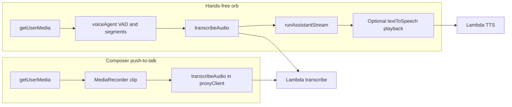
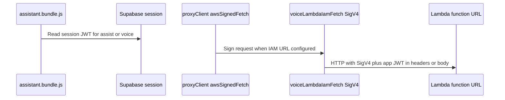

# Architecture: voice paths, bundles, and auth

## Two user-facing voice paths

| Path | Source file | Role |
|------|-------------|------|
| Composer mic | [`voiceInput.ts`](../../browser/base/content/assistant/build/src/services/voiceInput.ts) | Record, send blob to **`transcribeAudio()`**, fill composer input. |
| Orb | [`voiceAgent.ts`](../../browser/base/content/assistant/build/src/services/voiceAgent.ts) | VAD, segments, transcribe, **`runAssistantStream`**, optional TTS, echo guard. |

Both use **`transcribeAudio()`** and related helpers from [`proxyClient.ts`](../../browser/base/content/assistant/build/src/proxyClient.ts).

## Bundles and UI bridges

- **`npm run build`** in **`assistant/build`** produces **`browser/base/content/assistant/assistant.bundle.js`** (assistant bootstrap, graph, **`voiceAgent`** export, etc.).
- **`npm run build`** in **`ui-preact`** produces **`browser/base/content/assistant/dist/assistant.ui.bundle.js`** (+ CSS).

The Preact app attaches **window bridges** (for example `oasisVoiceAssistantTurnBegin`, `oasisVoiceSpokenTurnMirror`) so the bundled assistant can append chat rows without importing Preact from the core bundle. See [`App.tsx`](../../browser/base/content/assistant/ui-preact/src/App.tsx) and [`useAssistantRuntime.ts`](../../browser/base/content/assistant/ui-preact/src/hooks/useAssistantRuntime.ts).

## Auth and Lambda signing (high level)

- **Supabase:** Session used where the code requires authenticated assist or voice operations.
- **IAM / Cognito:** [`voiceLambdaIamFetch.ts`](../../browser/base/content/assistant/build/src/voiceLambdaIamFetch.ts) and [`awsSignedFetch.ts`](../../browser/base/content/assistant/build/src/awsSignedFetch.ts) implement SigV4 signing for Lambda function URLs as configured in `.env`.

## Prompts

Voice-specific system addenda live in [`voicePrompt.ts`](../../browser/base/content/assistant/build/src/prompts/voicePrompt.ts) (browser-first scope, recovery, spoken vs chat-text variants).

## Key files (quick map)

| Area | Path |
|------|------|
| Orb pipeline, VAD, TTS | `browser/base/content/assistant/build/src/services/voiceAgent.ts` |
| Composer recording | `browser/base/content/assistant/build/src/services/voiceInput.ts` |
| HTTP assist / transcribe / TTS | `browser/base/content/assistant/build/src/proxyClient.ts` |
| IAM voice HTTP | `browser/base/content/assistant/build/src/voiceLambdaIamFetch.ts` |
| Signed routing | `browser/base/content/assistant/build/src/awsSignedFetch.ts` |
| Assistant bootstrap, `voiceAgent` on window | `browser/base/content/assistant/build/src/assistant.ts` |
| Preact UI and bridges | `browser/base/content/assistant/ui-preact/src/App.tsx`, `hooks/useAssistantRuntime.ts`, `types.ts` |
| Shared types | `browser/base/content/assistant/shared/contracts.ts` |

## Related

- [build.md](build.md) — how bundles are produced
- [environment.md](environment.md) — env vars and failures
- [voice-ux-voice-features-vs-integrate.md](voice-ux-voice-features-vs-integrate.md) — historical comparison
