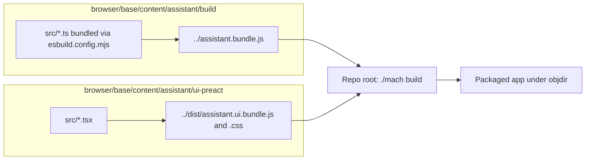

# Build: assistant bundle, Preact UI, and Firefox

Assistant logic and the sidebar UI are **bundled with esbuild** and the outputs are **checked in** (or produced next to sources) and then **packaged** by `./mach build`. After you change TypeScript under `build/src` or `ui-preact/src`, rebuild **both** npm bundles, then **Firefox**.

## Pipeline overview



The assistant document [`assistant.xhtml`](../../browser/base/content/assistant/assistant.xhtml) loads `assistant.bundle.js`; the Preact bundle is loaded by the assistant shell as your product wires it. After `npm run build`, run **`./mach build`** so the browser package picks up updated files.

## Commands (from repository root)

### 1. Assistant bundle (`assistant/build`)

```bash
cd browser/base/content/assistant/build
npm install
npm run build
```

**Success signals:**

- Terminal shows esbuild completion (for example **Done in …ms**) and a size line for **`../assistant.bundle.js`** (see [`esbuild.config.mjs`](../../browser/base/content/assistant/build/esbuild.config.mjs) `outfile`).
- **Exit code 0.**
- Optional: `ls -la ../assistant.bundle.js` shows a recent timestamp.

Use **`npm ci`** instead of **`npm install`** when you want a clean install from the lockfile (team policy).

### 2. Preact UI bundle (`ui-preact`)

```bash
cd ../ui-preact
npm install
npm run build
```

**Success signals:**

- esbuild reports output for **`../dist/assistant.ui.bundle.js`** and **`../dist/assistant.ui.bundle.css`** (see [`package.json`](../../browser/base/content/assistant/ui-preact/package.json) `build` script).
- **Exit code 0.**

### 3. Package into the browser

```bash
cd ../../../../..
./mach build
```

**Success signals:**

- Final summary includes **Your build was successful!**
- **Exit code 0.**

## Daily loop vs first-time

| Loop | When |
|------|------|
| **Full** `npm install` in both dirs | New clone, lockfile change, or `node_modules` missing. |
| **Skip `npm install`** | Only TS/TSX sources changed and dependencies unchanged; run **`npm run build`** in each dir only if needed. |
| **`./mach build`** | Always after changing bundle outputs you need in the running browser. |

## Build time expectations (rough)

| Step | Cold | Typical incremental |
|------|------|----------------------|
| `npm install` | Minutes | Seconds if caches warm |
| `npm run build` (each) | Seconds–tens of seconds | Often **under ~30 s** |
| `./mach build` | **Very long** first objdir | Often **~15–60 s** when only assistant assets changed |

## Do not commit local `node_modules` churn

Platform-specific binaries under `node_modules` (for example esbuild native shims) must not be committed ad hoc. Install locally; follow your team’s lockfile policy.

## Environment variables and rebuild

If you change **`build/.env.local`** (Lambda URLs, Cognito, Supabase-related build defines), you must run **`npm run build`** again in **`assistant/build`**, then **`./mach build`**. Details: [environment.md](environment.md).

## Related

- [onboarding.md](onboarding.md) — clone and bootstrap
- [architecture.md](architecture.md) — what the bundles contain
- [AGENTS.md](../../AGENTS.md) — repo-wide `./mach format` / `./mach lint` after edits
