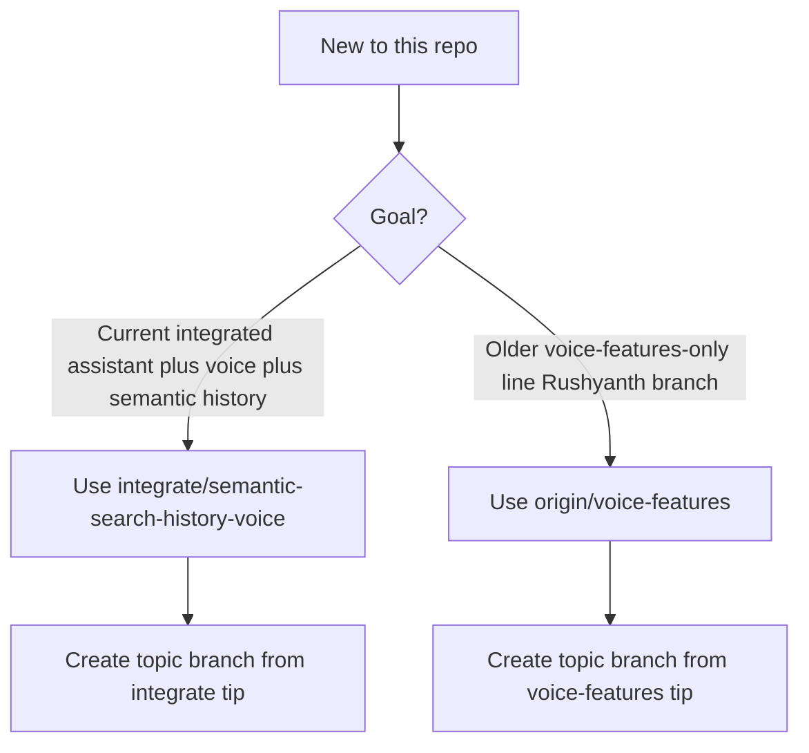

# Onboarding: clone, branches, and first-time setup

## Which branch should I use?



| Branch | When to use it |
|--------|----------------|
| **`origin/integrate/semantic-search-history-voice`** | Default for **new work** described in this doc set: assistant bundles, orb, composer STT, semantic history, current Lambda/IAM wiring. |
| **`origin/voice-features`** | Legacy **voice-features** line; use if your team explicitly tracks Rushyanth’s older branch or you are comparing behavior. See [voice-features-branch-setup.md](voice-features-branch-setup.md) and [voice-ux-voice-features-vs-integrate.md](voice-ux-voice-features-vs-integrate.md). |

## From zero: clone and verify remotes

**Success:** `git remote -v` shows `origin` with your team’s GitHub URL (HTTPS or SSH).

```bash
git clone <YOUR_TEAM_FIREFOX_OASIS_URL> firefox-oasis
cd firefox-oasis
git remote -v
```

## Check out the integration branch and create a topic branch

**Success:** `git status -sb` shows your topic branch (or `integrate/...` if you stayed on it) and `origin` is reachable.

```bash
git fetch origin
git checkout integrate/semantic-search-history-voice
git pull origin integrate/semantic-search-history-voice
git checkout -b feature/my-voice-work
```

Optional: track the remote integration branch while working locally:

```bash
git branch -u origin/integrate/semantic-search-history-voice
```

## First machine: toolchain bootstrap

If you **have never built this tree** (or a fresh clone on a new machine), run **once** from the **repository root**:

```bash
./mach bootstrap
```

**Success:** Bootstrap finishes without fatal errors; follow [Firefox source setup](https://firefox-source-docs.mozilla.org/setup/index.html) if a dependency step fails.

## First full browser build vs daily workflow

| Situation | What to run | Success signal |
|-----------|-------------|----------------|
| **First build** after bootstrap | `./mach build` from repo root | Final line includes **Your build was successful!** (may take **tens of minutes** on a cold objdir). |
| **Daily work** after changing only assistant TS/Preact | See [build.md](build.md): `npm run build` in `assistant/build` and `ui-preact`, then `./mach build` | esbuild **Done** lines; `mach build` success message; often **~15–60 s** incremental if only packaged assets changed. |

Rough expectations (hardware varies):

- **Cold** `./mach build`: **30+ minutes** possible on first objdir.
- **Incremental** `./mach build` after assistant bundle edits: often **under a minute** to a few minutes.

## Open the browser and find the assistant

```bash
./mach run
```

**Success:** Firefox (Oasis) window opens.

**Opening the assistant UI:** Product chrome varies by build and branding. Use the **sidebar** entry your team uses for the **AI chatbot / assistant** (Mozilla’s sidebar copy refers to an AI chatbot in the sidebar). If your internal docs name a toolbar button or menu path, follow those; otherwise ask your team for the **exact control** in your branded build.

**Sign in** when the assistant requires Supabase for voice or assist calls.

**Microphone:** Grant permission when prompted; use a dev profile if you want to reset permissions quickly.

## Next steps

- [build.md](build.md) — npm bundles and `./mach build` order with **success outputs**
- [environment.md](environment.md) — `.env.local` and backend URLs
- [testing.md](testing.md) — verify voice end-to-end locally
